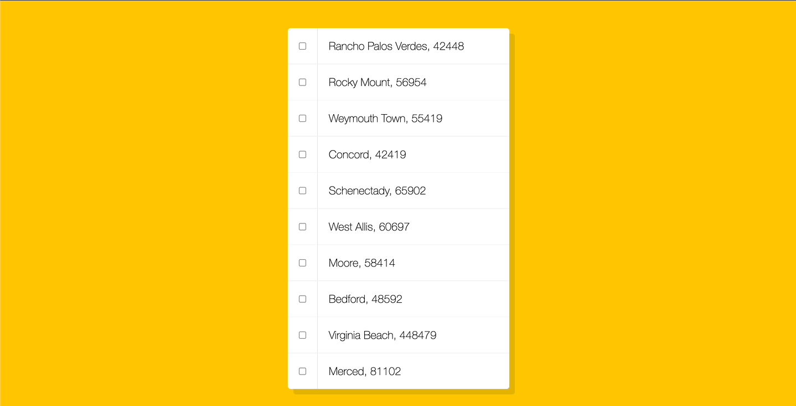

# JS30 - 10 hold shift to check multiple checkboxes

## Table of contents
  - [Overview](#overview)
    - [The challenge](#the-challenge)
    - [Screenshot](#screenshot)
    - [Links](#links)
  - [My process](#my-process)
    - [Built with](#built-with)
    - [What I learned](#what-i-learned)
    - [Continued development](#continued-development)
    - [Useful resources](#useful-resources)
  - [Author](#author)
  - [Acknowledgments](#acknowledgments)

## Overview

### The challenge

Users should be able to:

- make checkbox to be checked
- hold `shift` key and click the checkbox, could check a range of checkboxes once time.

### Screenshot



### Links

- [Solution URL](https://github.com/Beginneraboutlife116/JS30-10-hold-shift-to-check-multiple-checkbox)
- [Live Site URL](https://beginneraboutlife116.github.io/JS30-10-hold-shift-to-check-multiple-checkbox/)

## My process

### Built with

- Semantic HTML5 marku
- Flexbox
- CSS Grid
- [pnpm](https://pnpm.io/) - package manager
- [vite](https://vitejs.dev/)

### What I learned

I learned the `shiftKey` API and knowing usage case of `!` to toggle value.
And also, I have tried to use the [pnpm](https://pnpm.io/) instead of [npm](https://www.npmjs.com/).

1. In the [MouseEvent](https://developer.mozilla.org/en-US/docs/Web/API/MouseEvent), there has properties showing how we can use the event.
   - Except the `shiftKey`, we also could use the `altKey` and `ctrlKey`. It's really awesome to know these usage!
2. The way, Web bos finished this challenge, is great. Especially, this one:
```js
let inBetween = false
if (...) {
  inBetween = !inBetween
}
```
His solution also prevents people who know how to delete the HTML to change the inputDOMs index order.
Using this:
```js
checkboxes.forEach(checkbox => {
  if (checkbox === lastChecked || checkbox === this) {
    inBetween = !inBetween
  }
})
```
However, I find that if user hold their shift key and click the first checkbox three times to make it checked, it will check all checkbox behind the current one.

I think the reason for this is that `checkbox === lastChecked`, because lastChecked has memorized current checkbox at second time.

Once the third times happened, the `||` make `inBetween` to be `true` once time, so It won't close by `inBetween` which is still `true`.

I switch the record method from `lastChecked` to a list, `inputEvents`.

By this, it will record all checked checkbox.

If there are less one event in the inputEvents, despite that `shiftKey` is `true`, it will record it instead of starting looping the whole checkboxes.

3. I have tried the easy way of pnpm, just for build vite.

### Continued development

I would try to practice the drag and drop event, because lots of this input checkboxes could be dragged and dropped in the internet applications.

It could be fun!!🥳

## Author

Nice to meet you ☺️, here is:
- [My github](https://github.com/Beginneraboutlife116)

## Acknowledgments

Thank for [Web bos](https://wesbos.com/courses)' JS30, it gives lots of ideas and practice goals.